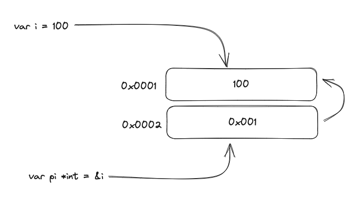

# Pointers

A _pointer_ is a piece of storage containing a value. That is, the location at which a value is stored.

For example:


Here the value `100` is stored at address `0x001` so the pointer to `100` reflects that information.

The expression `&i` is read as the _address of i_ and yields a pointer to an integer variable of type `*int` which reads like `pointer to int`.

We can say that `pi` **points** to `i`, or that `pi` **contains the address** of `i`

The variable to which `pi` points is written as `*pi`, this is called _dereferencing_ `pi`

```go
var i = 100
var pi *int = &i // pi of type *int points to i
fmt.Println(*pi) // prints 100

*pi = 200        // equivalent to i = 200
fmt.Println(*pi) // prints 200
fmt.Println(i)   // prints 200
```

Not every value has an address, but every variable does. For example, while it’s true that numeric literals like 42 are essential building blocks of code, they don’t directly have memory addresses. 

Numeric literals (such as 42, 3.14, or 0xFF) represent fixed values in your code. They are immutable and don’t occupy memory locations themselves. When you use a numeric literal, it’s like saying, “Here’s the value 42; use it as needed.”

Variables, on the other hand, provide named storage locations for values. When you declare a variable (e.g., var x int), you’re creating a place in memory to hold an integer value. Assigning a numeric literal to a variable (x = 42) associates that value with the variable.

Variables have memory addresses because they reside in memory. The address of a variable is where its value is stored. However, numeric literals themselves don’t have addresses—they’re like signposts pointing to specific values.

A [struct](#TODO) is a composite data type that groups together variables (fields) of different types, each field within a struct acts like a named variable and have addresses like _normal_ variables.

Each element in an [array](#TODO) has a position (or index) starting from zero, you can think of these positions as variables that hold specific values and thus have addresses too.

The zero value of a pointer is `nil`. And so pointers are comparable with `==` and `!=`. Two pointers are equal if they point to the same address.

It's ok for a function to return a pointer, and and also to pass pointers as arguments to functions. This way functions can change the value of a variable that was indirectly passed.
Use this with caution though, because it has side effects it can make your code harder to maintain and can also cause bugs.

For example the function:
```go
func increment(pi *int) int {
	*pi++
	return *pi
}

i := 10
fmt.Println(increment(&i)) // prints 11
```
The value of `i` was changed, but it's address was not.

Each time we create a pointer to a variable, we are creating an _alias_ to that variable. This has the side effect of finding all the references to a variable harder, because we also have to account for all the aliases.
